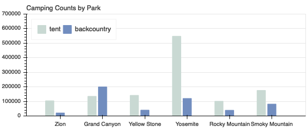
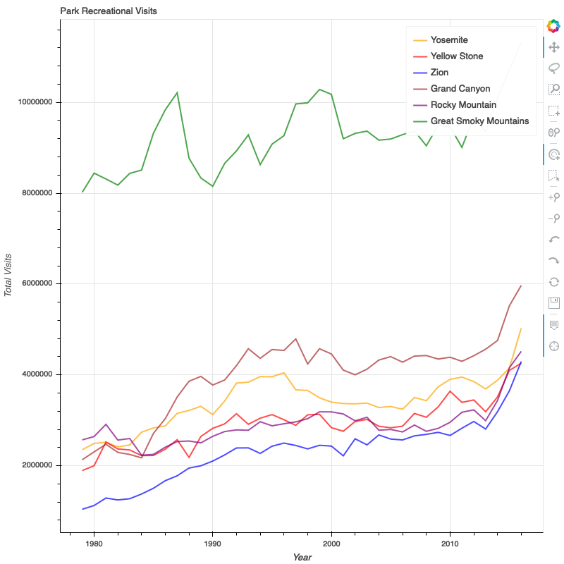

# NationalParkAnalysis

Analyze National Parks Data. 

Sources of data:

WorkFlow:
https://irma.nps.gov/Stats/SSRSReports/National%20Reports/Annual%20Park%20Ranking%20Report%20(1979%20-%20Last%20Calendar%20Year) - Reports in csv format

https://irma.nps.gov/Stats/SSRSReports/National%20Reports/Annual%20Visitation%20By%20Park%20(1979%20-%20Last%20Calendar%20Year)

https://www.nps.gov/state/ca/index.htm - National sites in the state

https://www.infoplease.com/state-abbreviations-and-state-postal-codes - Postal Code data

Multiple reports are available for the national parks data for the last 20 years. The reports did not have location of the parks like State. 
https://irma.nps.gov/Stats/SSRSReports/National%20Reports/Annual%20Park%20Ranking%20Report%20(1979%20-%20Last%20Calendar%20Year)

I decided to scrape the nps.gov website to get the parks by state since my initial investigation only gave a subset of park data (e.g., wikipedia)

After some analysis I figured I could get the parks in the state by this link but I have to loop through all the state codes to get all the parks by each state
https://www.nps.gov/state/ca/index.htm for California data

The html code of interest for extracting the actual park data is 
<code>

<h2></h2># This field has the type. Possible values: National Monument,National Park,National Historic Site, National Recreation Area
<h3><a href="/alca/" id="anch_9">Alcatraz Island</a></h3> #  This has the name of the national site
<h4>San Francisco, CA</h4> # This field has City followed by , and then state code

Alcatraz Island offers a close-up look at the site of the first lighthouse and US built fort on the West Coast, the infamous federal penitentiary long off-limits to the public, and the history making 18 month occupation by Indians of All Tribes. Rich in history, there is also a natural side to the Rock—gardens, tide pools, bird colonies, and bay views beyond compare.

 # this field has the description

  
 </code>
 
 h2 tag had the type of the national site. Eg: National Monument,National Park,National Historic Site, National Recreation Area
 h3 tag had the name of the national site
 h4 tag had the city and state code separated by ,
  p tag had the description of the park.
 
Since I was scarping the nps.gov for park name. As the data of interest here is name of the national site to get the geographical location I decided to store the information in this format in mongodb
 
 parkname:name of the park
 state:state where the park is located
 city:city of the park location
 type:type of park. Possible values:National Monument,National Park,National Historic Site, National Recreation Area
 description:description of the park
 
 ****
 I had to manually download the data in xslx format as the csv format was not user friendly. The download had to be done twice because I report was only available for 20 years but the data available was from 1979 to 2017.
 
 I had to do some data cleaning like renaming column names since the data I downloaded had multiple categories like:
 (Recreational Visits, Non Recreational Visits, ..) for all years so the strategy I used was to append the cateogory to the year so all the categories data can be read on one shot from a single xslx file
 
 The data was read from 2 xslx files and the data was merged and some columns like 'Average_1998_2017_Recreational_Visits', 'Average_1979_1997_Recreational_Visits' were dropped. 
 
 The data was not formatted correctly so I decided to go through some transformations and doing pivot table. I'm sure there is a easier way to do this.
 
 Given I was interested in the top national parks. I decided to take the following parks since they had the most visitors since 1979:
 1. Great Smoky Mountains NP
 2. Grand Canyon NP
 3. Zion NP
 4. Rocky Mountain NP
 5. Yosemite NP
 6. Yellowstone NP
 
 After initial analysis a line chart with the recreational visits of the top 6 parks for created and saved as src/recreational_visits.html
 
#### Reviewing the data I decided to do Chi-Squared Test

#### Null Hypothesis: People who like to do tent vs backcountry camping have no preference for a specific park/parks

#### Alternate Hypothesis: People who like tent vs backcountry camping have preference for a specific park/parks

#### Test Statistic
$\chi^2 = \sum_{\forall i,j} \frac{(Observed_{ij}-Expected_{ij})^2}{Expected_{ij}}$

#### For a level $\alpha$ test, reject Null Hypothesis if $\chi^2 > \chi^2_{(degrees of freedom, 1-\alpha)}$ and accept Null Hypothesis if $\chi^2 <= \chi^2_{(degrees of freedom, 1-\alpha)}$

##### Test Criteria
Do not use test if any expected values are less than 1 or if more than 1/5 of them are less than 5

##### Conclusions:

Parks - ('Zion','Grand Canyon','Yellow Stone', 'Yosemite','Rocky Mountain', 'Smoky Mountain')

Camping_categories - ('tent', 'backcountry')

###### The calculated $\chi^2 = 203937.53 $   

###### For 5 degrees of freedom and $\alpha$ = 0.05 (i.e., (1-$\alpha$) = 0.95 ) the  $\chi^2_{(degrees of freedom, 1-\alpha)}$ = 11.070
(Reference: https://www.itl.nist.gov/div898/handbook/eda/section3/eda3674.htm)

###### Since $\chi^2 > \chi^2_{(degrees of freedom, 1-\alpha)}$ we reject the null hypothesis - People who like to do tent vs backcountry camping have no preference for a specific park/parks

     
     
  ########################
  
  
  
# Project Name
National Park Service Visitor Data Analysis.
“Look deep into nature and then you will understand everything better.” - Albert Einstein

## Project Intro/Objective
The purpose of this project is to analyze the National Park Service visitor data from 1979-2017 and look for trends and similiarities of the different parks by multiple criteria like camping preferences, location etc., The bigger goal is to build a personal park recommender which best fits your preferences - Proximity, Camping Preferences etc., 

### Methods Used
* Chi Square Testing
* 

### Technologies and Packages 
* Python
* Jupyter
* PostGres, MongoDB
* Pandas, Numpy, Scipy
* Bokeh
* BeautifulSoup
*  

## Project Description
(Provide more detailed overview of the project.  Talk a bit about your data sources and what questions and hypothesis you are exploring. What specific data analysis/visualization and modelling work are you using to solve the problem? What blockers and challenges are you facing?  Feel free to number or bullet point things here)

## Needs of this project

- frontend developers
- data exploration/descriptive statistics
- data processing/cleaning
- statistical modeling
- writeup/reporting
- etc. (be as specific as possible)

## Getting Started

1. Clone this repo (for help see this [tutorial](https://help.github.com/articles/cloning-a-repository/)).
2. Raw Data is being kept [here](Repo folder containing raw data) within this repo.

    *If using offline data mention that and how they may obtain the data from the froup)*
    
3. Data processing/transformation scripts are being kept [here](Repo folder containing data processing scripts/notebooks)
4. etc...

*If your project is well underway and setup is fairly complicated (ie. requires installation of many packages) create another "setup.md" file and link to it here*  

5. Follow setup [instructions](Link to file)

## Featured Notebooks/Analysis/Deliverables
* [Notebook/Markdown/Slide Deck Title](link)
* [Notebook/Markdown/Slide DeckTitle](link)
* [Blog Post](link)

## Contributing DSWG Members

**Team Leads (Contacts) : [Full Name](https://github.com/[github handle])(@slackHandle)**

#### Other Members:

|Name     |  Slack Handle   | 
|---------|-----------------|
|[Full Name](https://github.com/[github handle])| @johnDoe        |
|[Full Name](https://github.com/[github handle]) |     @janeDoe    |

## Contact
* If you haven't joined the SF Brigade Slack, [you can do that here](http://c4sf.me/slack).  
* Our slack channel is `#datasci-projectname`
* Feel free to contact team leads with any questions or if you are interested in contributing!

 
