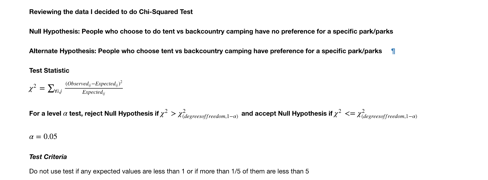
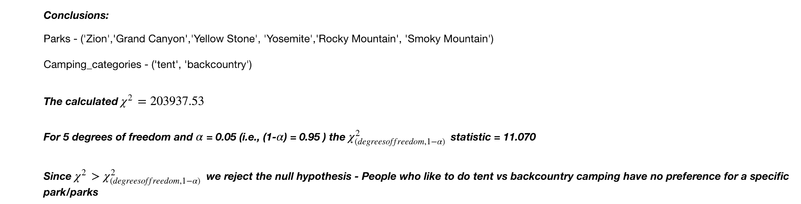

# NationalParkAnalysis  
  
# Project Name
National Park Service Visitor Data Analysis.

“Look deep into nature and then you will understand everything better.” - Albert Einstein

## Project Objective
The purpose of this project is to analyze the National Park Service visitor data from 1979-2017 and look for trends and similiarities of the different parks by multiple criteria like camping preferences, location etc., The bigger goal is to build a personal park recommender which best fits your preferences - Proximity, Camping Preferences etc., 

## Project Description
(Provide more detailed overview of the project.  Talk a bit about your data sources and what questions and hypothesis you are exploring. What specific data analysis/visualization and modelling work are you using to solve the problem? What blockers and challenges are you facing?  Feel free to number or bullet point things here)

### Directory Structure
* src - directory for all the code
* data - downloaded data (raw and cleaned)
* output - results
* database - database scripts

### Technologies and Packages 
* Python
* Jupyter
* PostGres, MongoDB
* Pandas, Numpy, Scipy
* Bokeh
* BeautifulSoup

### Sources of data
Reports Data available from 1979 - 2017
https://irma.nps.gov/Stats/SSRSReports/National%20Reports/Annual%20Visitation%20By%20Park%20(1979%20-%20Last%20Calendar%20Year)- Reports 

Park Information 
https://www.nps.gov/state/ca/index.htm - Retrieve the park details like park type, name, location etc.,

Postal Code Information
https://www.infoplease.com/state-abbreviations-and-state-postal-codes - Postal Code data to get the state codes to retrieve the park data for each state

### Data Engineering Highlights:
* Reports - After initial analysis the best format to download the reports was in excel format. The column names were manipulated so all the data for different categories can be loaded at one time. The data had to be downloaded as two excel files because of the max limit of 20years.
* Park Information - National Park Service website was web-scrapped using BeautifulSourp to get all parks located in all the states and provinces of United States and stored in MongoDB
* Data Storage - 

### Scope of the Initial Study
After intial analysis I decided to study camping preferences in the top 6 national parks. 
 1. Great Smoky Mountains NP
 2. Grand Canyon NP
 3. Zion NP
 4. Rocky Mountain NP
 5. Yosemite NP
 6. Yellowstone NP
 

#### Methods Used
* Chi Square Testing

#### Test
Test Details
 

#### Results
Recreational Visits of top 6 national parks

     
Camping Counts of top 6 national parks    
 
     
Test Conclusion
 

## Future Work
* Merge the report data and the web scrapped into a Postgres database.
* Run analysis on proximity of the park to a big city and the visitor count to the park
* Integrate with Instagram api to get the most popular parks
* Predict best time to visit a park on your personal preferences. (like - tent camping, back country camping, non-popular times etc.,)

## Acknowledgements
* To all the people in the open-source community who open heartedly built all the wonderful software and tools for the global community to use. To all the members of the online community who have spent their time answering and explaining all the concepts so it is easier for learners like me.

 
